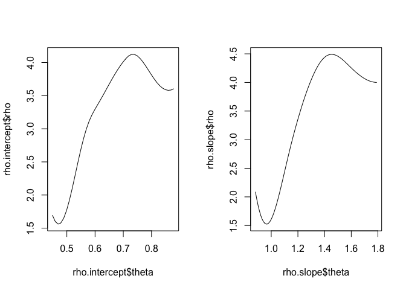

# robustDIF

An R package that provides functions for assessing differential item
functioning (DIF) in item response theory (IRT) models using methods
from robust statistics. Based on the paper: Halpin, P.F. (2022)
Differential Item Functioning Via Robust Scaling. (https://arxiv.org/abs/2207.04598).

Currently `robustDIF` only supports the two-parameter logistc (2PL) IRT
model in two independent groups.

## Installation

``` r
install.packages("remotes")
remotes::install_github("peterhalpin/robustDIF")
library(robustDIF)
```

## Example Dataset

The main user-facing functions are illustrated below using the built-in
example dataset `rdif.eg`. In the example dataset, there are a total of
five items and the first item has DIF on the intercept and slope. DIF on
the item difficulty (intercept slope) was additive and equal to 1/2. DIF
on the slope was multiplicative and equal to 2. The latent trait was
generated from *N*(0,1) in the reference group and *N*(.5, 1) in the
comparison group.

Check out the documentation for `rdif.eg` and `get_irt_pars` for more
info about how to format data for use with `robustDIF`.

## The RDIF procedure

The RDIF procedure involves IRT scaling parameters that are functions of
the parameters of the distributions of the latent trait. Letting

and

denote the mean and variance of the latent trait in the comparison
group, the scaling parameter used to test for DIF on the item intercepts
is
.
The scaling parameter used to test for DIF on the item slopes is
.

The `rdif` function estimates the IRT scaling parameters, and, as a
by-product, flags items with DIF at the desired asymptotic Type I Error
rate (`alpha`). In the context of DIF, we are mainly interested in the
flagging procedure.

In the output below, the estimated values of the scaling parameters are
indicated by `est`. Items with DIF are indicated by `weights = 0`. The
other output describes the iteratively re-weighted least squares
estimation routine (number of iterations and the convergence criterion).

``` r
# Item intercepts
(rdif.intercepts <- rdif(irt.mle = rdif.eg, par = "intercept", alpha = .05))
```

    ## $est
    ## [1] 0.4738
    ## 
    ## $weights
    ## [1] 0.0000 0.7900 0.9504 0.9644 0.9049
    ## 
    ## $n.iter
    ## [1] 7
    ## 
    ## $epsilon
    ## [1] 4.288e-08

``` r
# Item slopes
(rdif.slopes <- rdif(irt.mle = rdif.eg, par = "slope", alpha = .05))
```

    ## $est
    ## [1] 0.9679
    ## 
    ## $weights
    ## [1] 0.0000 0.9817 0.9993 0.8358 0.8178
    ## 
    ## $n.iter
    ## [1] 9
    ## 
    ## $epsilon
    ## [1] 4.618e-08

We can see that the first item exhibits DIF on both the slope and
intercept (i.e., it has a weight of zero in both outputs). The estimated
scaling parameters are good approximations of the data-generating
values.

## “Stand-alone” Wald tests

Inferences about DIF can also be made by following up `rdif` with
stand-alone Wald tests of the item parameters. The stand-alone tests can
be useful if one wishes to test for DIF using a different Type I Error
rate than was used with `rdif`.

To test each item parameter separately, use the function `z_test`:

``` r
# Wald test of item intercepts 
z_test(theta = rdif.intercepts$est, irt.mle = rdif.eg, par = "intercept")
```

    ## $z.test
    ## [1]  5.6122  0.6535 -0.3107 -0.2627  0.4328
    ## 
    ## $p.val
    ## [1] 1.997e-08 5.135e-01 7.560e-01 7.928e-01 6.652e-01

``` r
# Wald test of item slopes
z_test(theta = rdif.slopes$est, irt.mle = rdif.eg, par = "slope")
```

    ## $z.test
    ## [1]  3.33204  0.18811 -0.03699  0.57398 -0.60617
    ## 
    ## $p.val
    ## [1] 0.0008621 0.8507924 0.9704938 0.5659824 0.5444002

Alternatively, the user can test both item parameters together using a
Wald test on two degrees of freedom, which tends to have slightly better
statistical power (true positive rate) than the flagging procedure or
one-parameter tests:

``` r
# Wald test of both parameters
chi2_test(theta.y= rdif.intercepts$est, 
          theta.z = rdif.slopes$est,
          irt.mle = rdif.eg)
```

    ## $chi.square
    ## [1] 67.4716  0.5407  0.1031  0.5451  0.6329
    ## 
    ## $p.val
    ## [1] 2.220e-15 7.631e-01 9.498e-01 7.614e-01 7.287e-01

## The Rho function

For data analyses, it is useful to check whether the M-estimator of the
IRT scaling parameters has a clear global minimum before proceeding to
make inferences about DIF. In `robustDIF`, the minimization problem is
described by `rho_fun`.

``` r
# Rho function for item intercepts
rho.intercept <- rho_fun(irt.mle = rdif.eg, par = "intercept", grid.width = .01)
par(mfrow = c(1,2))
plot(rho.intercept$theta, rho.intercept$rho, type = "l")

# Rho function for item slopes
rho.slope <- rho_fun(irt.mle = rdif.eg, par = "slope", grid.width = .01)
plot(rho.slope$theta, rho.slope$rho, type = "l")
```

<!-- -->

Note the minimizing values of theta in the plots corresponds closely to
the values reported by `rdif` above.
